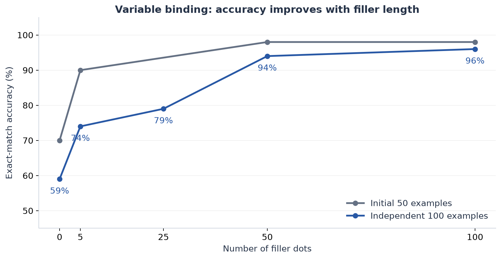
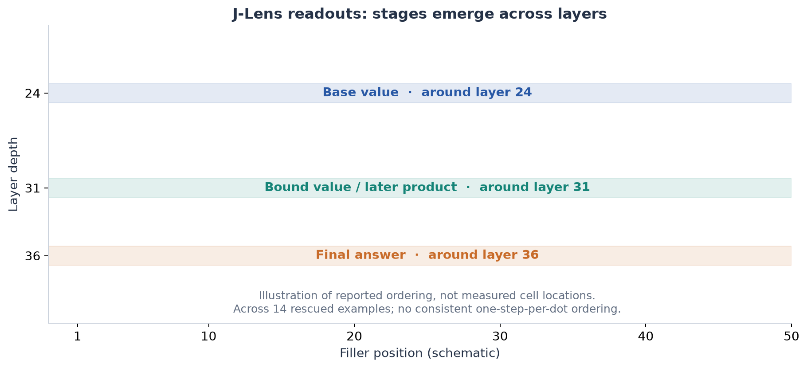
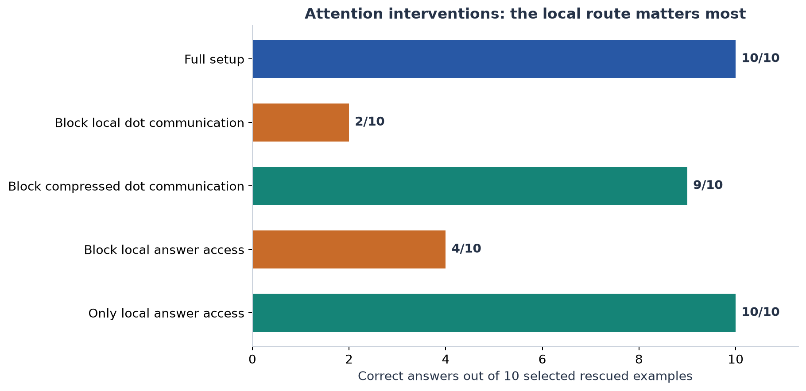

# JLENS project — illustrated results handoff

**Historical snapshot:** September 4, 2026, 20:36 UTC.  
**Scope:** The original detailed 18-part conversation summary, preserved verbatim with figures inserted. The text reports prior experiments; this handoff does not rerun them or independently audit raw outputs. Later work in the repository is outside this snapshot.

## Reading and reuse

- The main summary below retains the original wording, including its interpretations. Figure captions and the handoff notes distinguish selected cohorts, schematics, and limitations.
- Open this file in a Markdown viewer. Keep the adjacent `figures/` folder when sharing it. Each figure is supplied as PNG and SVG.
- `original-summary.md` contains the exact source summary without figures. `figure-data.json` records the plotted values. `build_handoff.py` regenerates this package with Python and Matplotlib; its source path may need updating on another computer.
- Source: `main-project-conversation.md`, assistant message `2026-09-04T20:36:48.591Z`. No credentials or connection details are included.

---

## Bottom line

DeepSeek really does use the filler dots on the variable-binding task. But it does **not** appear to perform one clean reasoning step per dot.

Instead:

1. The reasoning stages emerge mainly as the signal moves through **network layers**.
2. The dots provide many temporary places to **store, copy, and reinforce** that information.
3. Most dots only need access to roughly the previous two dots, suggesting a **rolling workspace**.
4. The useful state is distributed across many dimensions and DeepSeek’s four internal mHC streams.
5. J-Lens can read and locate parts of this computation, but the decoded token itself is usually a **summary of the state**, not the complete causal representation.

---

## Two tools we used

- **Logit lens:** asks, “If the model had to produce a token from this internal state right now, what token would it resemble?”
- **Jacobian Lens/J-Lens:** first transports the state through an average approximation of the remaining network, then decodes it.

A readout such as `125` means “this state is associated with token 125.” It does **not** prove that the model literally stores the number as that token.

---

# 1. We validated that the J-Lens was attached correctly

### Method

1. Inspected the exact DeepSeek V4 Flash checkpoint and released lens.
2. Verified tokenization, layer counts, dimensions, normalization, and unembedding.
3. Captured DeepSeek’s four-stream residual state.
4. Collapsed those streams with the model’s official `hc_head`.
5. Applied the J-Lens matrix, final norm, and unembedding.
6. Compared late-layer results with the model’s real output logits.
7. Tested ordinary prompts such as “The capital of France is…”

### Result

- DeepSeek has 43 transformer blocks and four mHC streams.
- The released lens contains 42 matrices for layers 0–41.
- Layer 42 is absent because layer 41 is the lens’s fitting target; we separately decode the actual final layer.
- Final reconstruction checks passed.
- For “The capital of France is,” J-Lens increasingly decoded concepts such as `capital` and `Paris`; `Paris` became top-1 around layer 37.

### Meaning

The pipeline appears technically sound. The missing layer 42 is intentional, not a corrupted download.

The remaining uncertainty is that the lens metadata does not explicitly document how the four mHC streams were projected during lens training. Our projection is the model’s own official final-stream collapse, but that convention is partly inferred.

---

# 2. The tungsten-plus-carbon calibration

The question was:

> What is the atomic number of tungsten plus the atomic number of carbon?

The expected chain is:

> tungsten → 74  
> carbon → 6  
> 74 + 6 → 80

### Method

1. Used the filler paper’s few-shot prompt style.
2. Placed ten verified dot tokens between the question and answer cue.
3. Ran both filler and no-filler versions.
4. Recorded J-Lens and logit-lens top tokens at every dot and layer.
5. Tracked tokenizer variants of `74`, `6`, and `80`.

### Result

- The model answered `80` both with and without dots.
- J-Lens found:
  - `74` at rank 1 around layer 36, filler position 4.
  - `6` at rank 5 around layer 36, filler position 8.
  - `80` never reached the top 10; its best rank was about 89.
- Logit lens also found the inputs, but generally less clearly.
- Reversing “tungsten and carbon” changed where the numbers appeared, even though the answer remained 80.

### Meaning

The dots contain decodable retrieved facts, but this example does not demonstrate that dots improve performance.

The facts do not live in fixed slots like “dot 4 always stores the first number.” Their locations change with the prompt.

Also, a model can produce the correct sum without the final number ever becoming an obvious top readout at a filler position.

---

# 3. A three-fact addition example

We tested:

> tungsten + carbon + oxygen  
> 74 + 6 + 8 = 88

### Method

1. Added another retrieved fact and arithmetic step.
2. Tested dots, no dots, and different fact orders.
3. Tracked the inputs, partial sums, and final answer.

### Result

- The model was wrong: it produced values such as `106`, `96`, `90`, or `42`.
- Nevertheless, J-Lens sometimes decoded the correct answer:
  - `88` reached rank 2 at one filler cell.
  - The partial result `80` was also visible.
- Logit lens ranked these candidates much lower.

### Meaning

J-Lens can reveal a correct latent candidate even when the model ultimately selects the wrong answer.

This was an early warning that:

> “The correct number is decodable” is not the same as “the model will use it correctly.”

---

# 4. We screened many tasks before choosing one

We intentionally looked for tasks where dots actually improve accuracy.

## Repeated modular squaring

### Method

Tested 100 semiprime modular-squaring problems, with depths \(T=1\) through \(T=10\), and 0, 1, 3, 5, 10, 25, 50, or 100 dots.

### Result

Accuracy stayed extremely low:

- 0 dots: 2%
- Best settings: 7%
- No \(T=10\) problem was solved.

In one \(T=10\) example, the model returned the first squared value instead of completing the chain. J-Lens did not reveal a convincing sequence of intermediate residues.

### Meaning

This task was too difficult for this model/prompt. Because performance was near zero, it could not tell us much about successful filler computation.

## Two-fact retrieval and addition

Accuracy moved from 41% without dots to 44–45% with 50–100 dots.

### Meaning

A possible small effect, but not strong enough for mechanism work.

## Three-fact addition

Accuracy was 6.7% without dots and generally worse with dots.

### Meaning

Too hard.

## Element-name letter selection

Accuracy was already about 92%; dots raised it to roughly 94%.

### Meaning

Too close to ceiling. J-Lens often decoded the element name more clearly than the selected letter, suggesting retrieval was easier to read than the final operation.

## Pointer chasing

Accuracy rose from 30% to 37.5% with 50–100 dots. The improvement came mainly from two-hop cases; longer chains remained unsolved.

### Meaning

Potentially interesting, but weaker than variable binding.

## Arithmetic programs

Dots reduced accuracy from 18.8% to 12.5%.

### Meaning

No useful filler benefit.

## Easy and hard branching tasks

- Easy version: already 94.4%, no improvement.
- Hard version: around 5%, no dependable improvement.

### Meaning

One was too easy and the other too hard.

---

# 5. Variable binding was the clear positive result

A simplified example looks like:

> Let `suv` be 64.  
> The value bound to `kur` is twice `suv`, minus 9.  
> The answer is twice `kur`, minus 14.  
> [dots]  
> Answer:

The model must retrieve a supplied value, compute an intermediate value, bind it to another name, retrieve it again, and compute the answer.

### Method

1. Generated controlled variable-binding problems.
2. Evaluated the same examples with 0, 5, 10, 25, 50, and 100 dots.
3. Used exact-match numeric accuracy.
4. Counted examples rescued or harmed by dots.
5. Repeated the test on independent examples and counterfactual prompt families.

### Result

First 50 examples:

- 0 dots: 70%
- 5 dots: 90%
- 50 dots: 98%
- 100 dots: 98%

Independent 100 examples:

- 0 dots: 59%
- 5 dots: 74%
- 25 dots: 79%
- 50 dots: 94%
- 100 dots: 96%

At 50 dots:

- 35 examples were rescued.
- 0 were harmed.
- The improvement was extremely statistically significant.

In an exact-layout counterfactual set:

- 0 dots: 14/48 correct
- 50 dots: 42/48
- 100 dots: 47/48

### Meaning

This is the strongest evidence that the filler tokens genuinely help DeepSeek compute.

The task is neither too easy nor too hard, and the improvement replicates across new examples and prompt families.

---

*Figure 1. Exact-match accuracy on two reported variable-binding cohorts. Lines connect tested dot counts; they do not represent measurements between them. Some historical sweeps changed demonstration filler as well as target filler.*

---

# 6. What J-Lens says the variable-binding algorithm looks like

The known stages were approximately:

1. Supplied/base number
2. First arithmetic product
3. Newly bound variable value
4. Second product
5. Final answer

### Method

1. Captured all four-stream residual states at every dot and layer.
2. Decoded every cell with both J-Lens and logit lens.
3. Recorded the first layer and filler position where each known intermediate became strongly decodable.
4. Repeated this on examples that were wrong without dots but correct with dots.
5. Shuffled expected tokens across examples as a control.

### Result

Across 14 rescued examples, J-Lens typically found:

- Base value: around layer 24
- Bound/intermediate value: around layer 31
- Later product: around layer 31
- Final answer: around layer 36

The ordering by **layer** was extremely consistent.

The ordering by **dot position** was weak or absent.

Shuffling expected values across examples almost completely destroyed the matches, so the readouts were example-specific, not generic digit preferences.

### Meaning

The algorithm seems to progress mainly through network depth:

> early layers retrieve inputs → middle layers form bound values → later layers form/select the answer

It does not look like:

> dot 1 performs step 1 → dot 2 performs step 2 → dot 3 performs step 3

Instead, many dots participate in the same layer-wise computation.

---

*Figure 2. Schematic of the approximate first-decodable layer ordering reported across 14 rescued examples. Bands are illustrative, not measured layer × position heatmaps.*

---

# 7. More dots mostly create more copies

### Method

Compared the same problem with different numbers of filler dots and counted how many layer-position cells strongly decoded each intermediate.

### Result

Longer filler sequences generally produced:

- More locations containing the intermediate.
- More repeated copies across positions.
- Sometimes earlier or stronger appearance.
- Better final accuracy.

Some examples crossed a threshold:

- Wrong with 25 dots despite having some visible intermediate signal.
- Correct with 50 dots after the signal became widespread.
- Another became correct only at 100 dots.

### Meaning

The benefit of more dots seems less like “more sequential reasoning steps” and more like:

> more workspace capacity, redundancy, and chances for the correct state to reach a useful destination

---

# 8. The dots are genuinely causal

## Prompt factorial

### Method

For ten examples that were wrong with no dots and correct with 50 dots, independently varied:

1. The system instruction mentioning filler.
2. Dots inside demonstrations.
3. Dots after the target question.

### Result

- Full setup: 10/10 correct.
- Removing target dots: usually only 0–3/10 correct.
- Target dots alone: about 5/10.
- Target dots plus dotted demonstrations: 9–10/10.

Putting 50 dots **before the question** produced no aggregate benefit.

### Meaning

The effect is not merely caused by telling the model “use filler tokens.”

Dots must occur after the question, where the model can use them as computation space. Demonstrations teach or prime the behavior, but the target dots do real work.

---

# 9. The rolling-workspace result

### Method

For 35 examples rescued by 50 dots, modified the attention mask so every dot could access only the most recent \(k\) earlier dots.

The prompt still contained all 50 dots; we only restricted communication between them.

### Result

- Access to 0 earlier dots: 20% correct
- Most recent 1 dot: 40%
- Most recent 2 dots: 80%
- Most recent 4 dots: 82.9%
- Most recent 8 dots: 85.7%
- Most recent 16 dots: 88.6%
- Most recent 32 dots: 94.3%
- Full history: 100%

Other attention controls showed:

- Preventing dots from communicating: almost destroys the benefit.
- Preventing dots from reading the question: almost destroys it.
- Preventing the answer from reading the dots: strongly hurts performance.

### Meaning

Most computation can travel through a short rolling window:

> question → recent dot state → next dot state → next dot state

Roughly two recent states are enough for most examples. Harder examples benefit from a longer history.

This was a causal attention-mask experiment, not a J-Lens result. J-Lens helps show what information travels through this workspace.

---

*Figure 3. All 50 dots remain present. The intervention restricts recent predecessor access through exact local attention. These 35 examples were selected because 50 dots rescued them; full-history accuracy is therefore 100% by selection. Other communication routes remain available. This figure does not use J-Lens.*

---

# 10. Local attention matters more than DeepSeek’s compressed path

DeepSeek has both exact/local attention and compressed attention mechanisms.

### Method

Selectively removed communication through each path while preserving the other.

### Result

- Removing exact/local dot communication reduced accuracy to about 2/10.
- Removing only the compressed path left accuracy around 9/10.
- Removing exact/local access from the answer reduced accuracy to about 4/10.
- Using only exact/local access at the answer preserved 10/10.

### Meaning

The useful filler computation relies primarily on the exact/local attention route. DeepSeek’s compressed attention path was not the main carrier in these experiments.

---

*Figure 4. Reported attention-path interventions on ten selected rescued examples. These are causal masking results, not J-Lens readouts, and are not overall task accuracies.*

---

# 11. Candidate competition explains some strange dot-count effects

One problem had this correct chain:

> 64 → 128 → 125 → 250 → 235

A plausible wrong sibling route ended in `185`.

### Method

1. Ran the identical problem with different dot counts.
2. Tracked both the correct and sibling-route values using J-Lens.
3. Counted how many cells strongly represented each candidate.

### Result

The model was:

- Correct with 5 dots
- Wrong with 10 and 25 dots
- Correct again with 50 and 100 dots

At 25 dots, J-Lens strongly represented the correct intermediate `125`, but many cells represented the wrong final candidate `185`.

At 50 dots, both `235` and `185` were widespread, but the model selected `235`.

### Meaning

More dots can amplify both correct and incorrect candidates.

Accuracy depends on:

- which candidates are present,
- where they appear,
- which positions receive them,
- and how the model selects among them late in the network.

Therefore, simply summing all readout scores can be misleading.

---

# 12. Formal J-space decomposition

This is different from ordinary J-Lens top-token readouts.

### Method

1. Found the released, pinned sparse nonnegative decomposition implementation.
2. Used gradient pursuit with \(k=25\).
3. Decomposed ten preselected filler activations into J-Lens dictionary vectors.
4. Checked reconstruction and compared against logit-lens and random rotated dictionaries.

### Result

- When a task token was J-Lens rank 1, it was selected as a sparse atom in 7/7 cases.
- Tokens ranked 2–25 were selected in 0/9 cases.
- When `235` was rank 1 and `185` rank 2 in one cell, the decomposition selected `235` and omitted `185`.
- Reconstruction explained only about 6.6% of activation squared norm.
- Random and logit-lens dictionaries reconstructed slightly more globally.
- J-space and logit-lens selected substantially different atoms.

### Meaning

Individual cells often behave like local winners: one candidate dominates that cell.

The broader competition occurs **across different filler cells**, not necessarily as a neat mixture inside each cell.

However, the sparse decomposition explains only a small part of the total state and is not uniquely determined. It should not be treated as a complete description of the activation.

---

# 13. Whole-state causal patching

### Method

1. Created matched problems differing in one input number.
2. Used J-Lens to find cells associated with a donor problem’s intermediate or answer.
3. Copied the donor’s entire four-stream residual state into the target example.
4. Measured whether the donor answer became more likely.
5. Compared J-selected, logit-lens-selected, random, and complementary cells.

### Result

- Many J-selected patches dramatically increased the donor answer’s probability.
- In strong examples, the donor answer moved from roughly rank 70–80 to ranks 2–7.
- J-Lens rank correlated with causal effectiveness.
- Random patches were weaker.
- Logit lens was often similarly effective and occasionally better.
- The original target answer usually remained rank 1, so complete answer swaps were uncommon.

### Meaning

J-Lens can identify locations that genuinely carry counterfactual information.

But this experiment copied the **whole activation**, so it did not prove that the decoded token direction itself was the causal feature.

---

# 14. Information is highly portable across dots

### Method

1. Chose one strongly J-Lens-identified donor state.
2. Transplanted it into each of the 50 possible target dot positions at the same layer.
3. Repeated this for six counterfactual directions and for intermediate versus final-answer states.

### Result

- Answer-state patches helped at all 300 tested destinations.
- Product-state patches helped at 297/300 destinations.
- The original same-position destination was rarely the best.
- Late dots—especially positions near 40–50—were often the strongest receivers.
- Removing several top cells caused only small damage because many other copies remained.

### Meaning

The state is not tied to one semantic dot.

A useful interpretation is:

- Early/middle dots help generate and relay information.
- Many dots hold interchangeable copies.
- Certain late dots are especially good places for the answer mechanism to read from.

This is a mixture of **broadcasting, redundancy, and position-dependent receiver gain**.

---

# 15. Directly changing the J-Lens token direction mostly failed

### Method

Instead of copying the full state:

1. Differentiated the J-Lens score for a selected token.
2. Suppressed or amplified only that small readout direction.
3. Compared it with logit-lens, random, paired-token, and J-only-orthogonal controls.
4. Verified that the intervention really changed the local J-Lens score.

### Result

- We could reduce a local J-Lens token score by about 6–7 logit units while changing only around 0.2% of the raw activation norm.
- Yet the correct answer almost always remained rank 1.
- Amplifying a donor token did not reliably make the model produce the donor answer.
- The J-Lens component orthogonal to logit lens had no special causal advantage.

### Meaning

The readable token direction is usually neither necessary nor sufficient.

In simple terms:

> J-Lens can correctly label what a state is about, but that label is not the model’s entire working code.

This is one of the most important cautions in the project.

---

# 16. Where the causal information actually lives

### Method

For strong whole-state patches, split the donor–target difference into:

1. The span of expected J-Lens token directions.
2. Everything orthogonal to those directions.
3. A combined J-Lens plus logit-lens span.
4. Random equal-sized spans.
5. Each of DeepSeek’s four mHC streams.
6. Different combinations of streams.
7. Partial-strength and complementary-coordinate interventions.

### Result

The expected-token J-Lens span:

- Was only about 2% of the state’s norm.
- Explained roughly two-thirds of the change in the **J-Lens readout**.
- Explained only about 8% of the causal effect for an intermediate.
- Explained essentially none of the causal effect for final answers.

The large orthogonal remainder preserved roughly 80% or more of the causal effect.

A striking example:

- Full patch moved the donor answer from rank 73 to rank 3.
- J-Lens token subspace had almost no effect.
- The J-Lens-orthogonal remainder moved it to rank 8.

Partial patches also combined nonlinearly:

- Two halves could each have moderate effects.
- Applying both together produced much more than the sum of their separate effects.

### Meaning

Most operational information is:

- high-dimensional,
- distributed,
- nonlinear,
- and invisible to a small set of token-decoder directions.

J-Lens reads a useful summary, not the complete computational payload.

---

*Figure 5. Left: one reported donor-state patch, showing donor-answer rank before and after intervention. Right: approximate state-dissection pilot summaries. The J-Lens component uses the tested expected-token directions, not every possible J-Lens direction. Norm share, readout change, and causal transfer are different quantities.*

---

# 17. DeepSeek’s four mHC streams have different roles

At every token, DeepSeek carries four parallel residual streams rather than one ordinary residual vector.

### Method

1. Split causal patches by stream.
2. Measured both:
   - how much each stream changed the J-Lens readout;
   - how much each stream changed the final answer.
3. Tested individual streams and stream combinations.

### Result

A simplified pattern emerged:

- **Stream 3:** often carried the clearest J-Lens-readable token summary.
- **Stream 2:** often carried much of the operational intermediate payload.
- **Streams 0, 2, and 3 together:** were important for final-answer effects.
- **Stream 1:** was often relatively dispensable.
- Combining streams produced much larger effects than their individual contributions predicted.

In some cases, removing stream 2 preserved almost the entire J-Lens score but destroyed most of the causal effect.

### Meaning

DeepSeek appears to separate:

- information that is easy for our decoder to read, and
- information that the model actually uses operationally.

The final answer depends on a cross-stream conjunction, not one readable scalar feature.

This could be specific to DeepSeek’s mHC architecture.

---

# 18. Smaller-model comparison

### Method

Ran related variable-binding prompts on smaller Qwen models, using logit lens where J-Lens was unavailable.

### Result

- Qwen3-4B: 0/100 both with and without dots.
- Qwen3-30B-A3B: 8/100 without dots and 5/100 with dots.

### Meaning

Those models did not show the filler benefit in this setup.

But both were close to floor, so this does not prove that DeepSeek’s architecture uniquely causes the effect. A fair architecture comparison needs tasks individually calibrated to each model.

---

# What we learned beyond the original logit-lens-style result

The most important new findings are:

1. **Dots are causally used**, not merely correlated with better answers.
2. **The algorithm unfolds through layers, not one step per dot.**
3. **Dots form a short-range rolling workspace:** two recent states are often sufficient.
4. **Information is redundantly broadcast across many dots.**
5. **Late positions are stronger receivers**, regardless of where the information originated.
6. **Correct and incorrect candidates can coexist across different cells.**
7. **Formal J-space often selects a local winner**, refining the ordinary ranked-token view.
8. **J-Lens-selected cells are causally informative**, even though J-Lens is not uniformly better than logit lens.
9. **The readable token direction itself is not the causal code.**
10. **Most causal information is distributed and nonlinear.**
11. **DeepSeek’s mHC streams separate readable summaries from operational payloads.**

## Simplest overall picture

A good mental model is:

> The layers perform the stages of the algorithm.  
> The dots provide a rolling set of scratchpads.  
> Information is repeatedly copied across those scratchpads.  
> Multiple answer candidates may be active at once.  
> Late layers and late filler positions select and consolidate the answer.  
> J-Lens lets us read labels attached to this process, but most of the actual machinery lives in a larger distributed state.

That makes the filler tokens genuinely useful, but their benefit is better described as **parallel workspace, redundancy, and routing** than as a visible serial chain of thoughts.

---

## Handoff notes — interpretation and next work

These notes are additions to the historical response above.

- **Calibration wording:** Section 2's weak `80` result refers to the numeric token. Earlier records also report the lexical token ` eighty` as J-Lens top-1 at layer 40, filler 4.
- **Layer and stream compatibility:** Exact final-head closure and the layer-41 identity check do not independently confirm the projection used when the pretrained lens was fitted. Publisher confirmation remains relevant.
- **Scope of causal claims:** Attention-mask results are separate from J-Lens-guided evidence. Masking can introduce distribution shifts. The short-window experiment does not establish a literal two-register circuit.
- **Direction interventions:** Successful local score edits with little answer change show robustness to the tested edits. They do not prove universal non-necessity or non-sufficiency of every J-Lens direction.
- **State dissection:** The approximately 2% figure concerns donor–target state-change norm, not total activation norm or explained variance. The orthogonal remainder is defined relative to the tested token span.
- **Generalization:** Strong behavioral cohorts and small selected mechanistic cohorts answer different questions. Stream roles, candidate competition, and sparse decomposition need broader replication.

### Outstanding baselines at the end of the supplied conversation

1. Alternative filler identities, with tokenization and length controlled.
2. Target-dot sweeps with demonstration geometry held fixed.
3. Full 50–100-example J-Lens/logit-lens Recall@k and MRR, stratified by answer correctness.
4. Cross-example mean-subtracted scores, alongside raw scores.
5. Shuffled J-Lens layer assignments.
6. Larger held-out causal and mHC-stream cohorts.
7. Cross-model comparisons calibrated away from floor and ceiling.
8. Matched attention-mask controls for intervention distribution shift.
9. Additional dataset seeds and checkpoint/revision replication where feasible.

This is the historical gap list, not a claim that the current repository still lacks every item.
